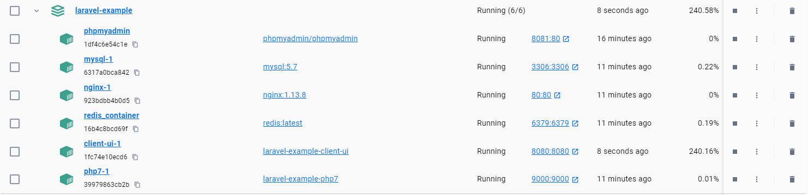
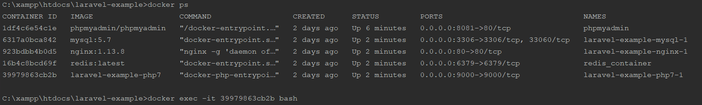
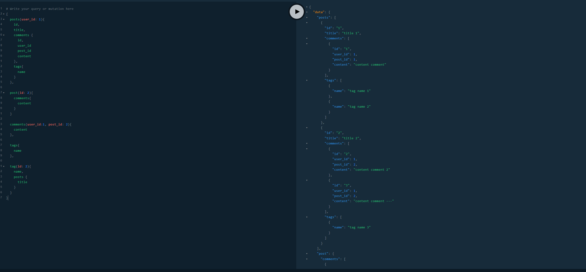
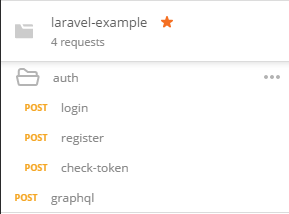
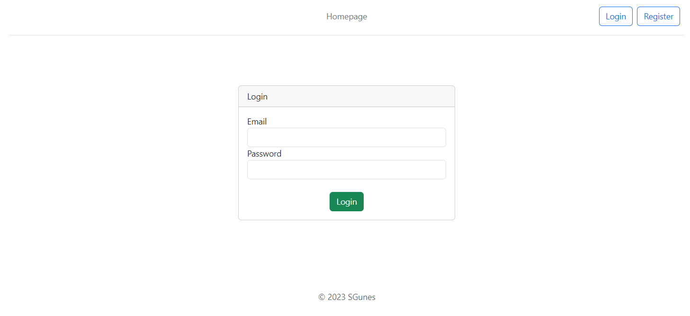
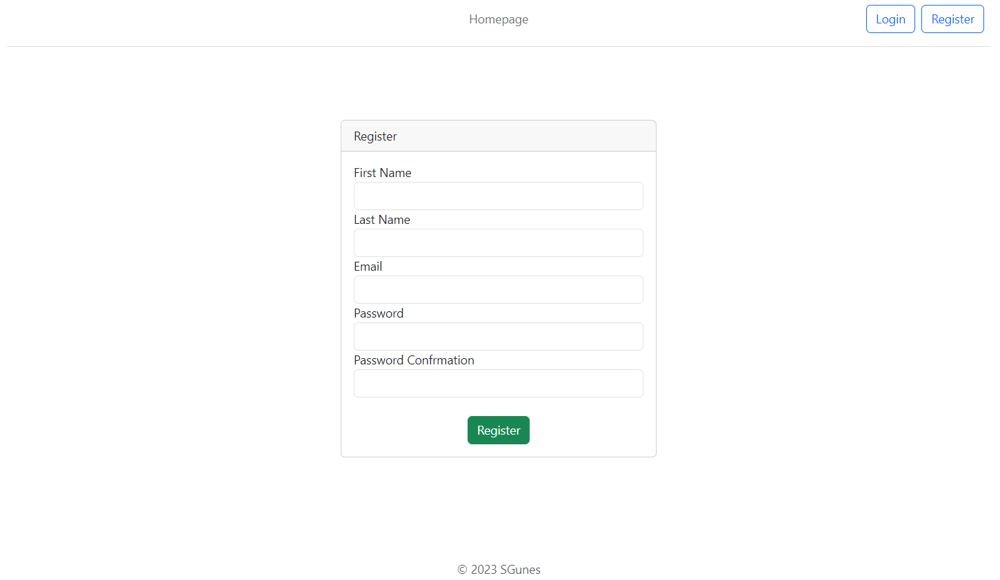
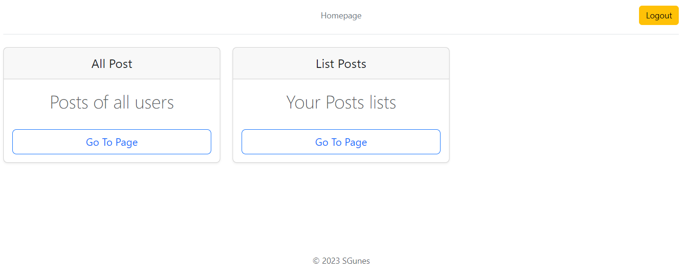
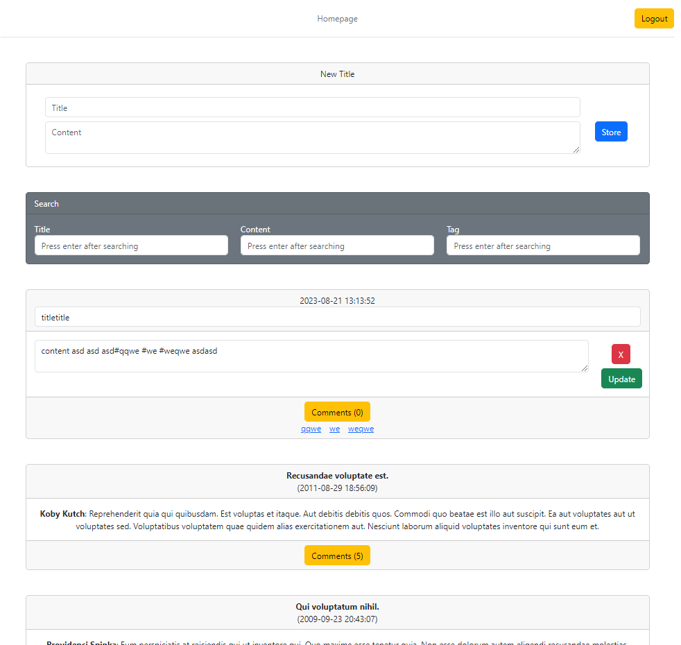
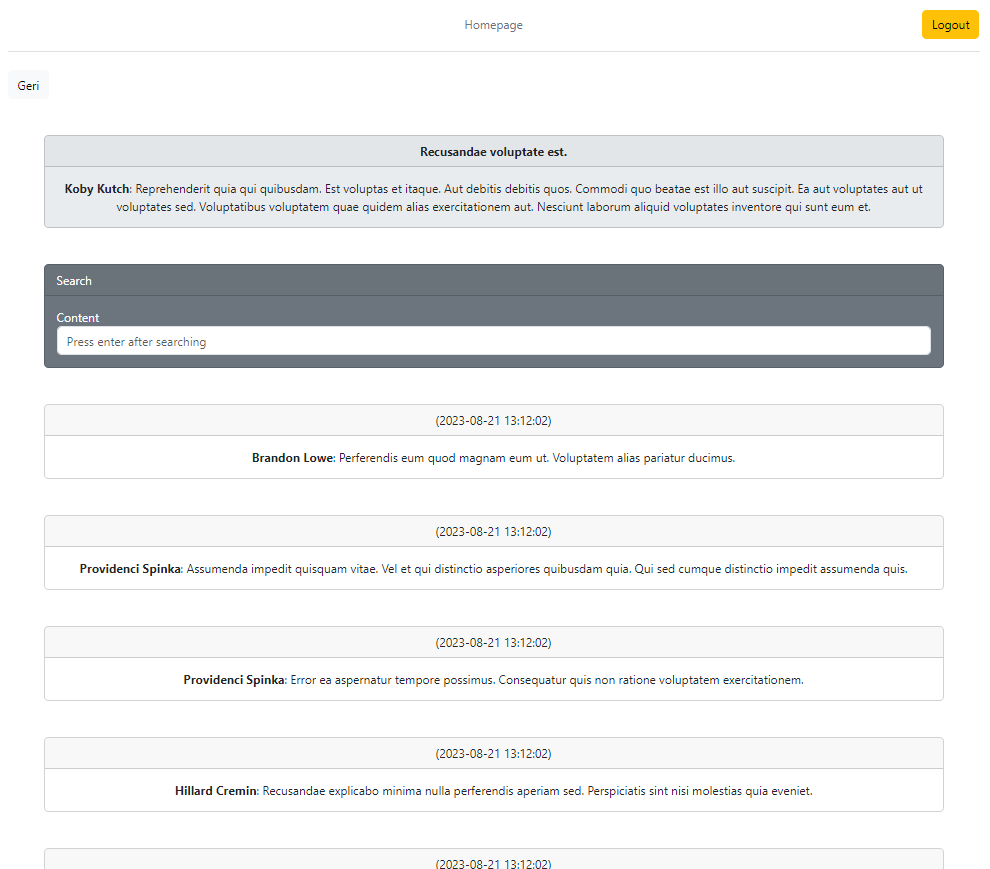

Hello! I have developed a blog application in 
my Docker-based project using Laravel and Angular. 
The project incorporates services like Php, MySQL, 
Phpmyadmin, Redis, and Nginx. In the Laravel realm, 
I made use of features such as JWT Token for authentication, 
GraphQL for data querying, Redis Queue for queue processing, 
Observer and Event Listener for data listening and event management, 
Commands for custom commands, 
Faker for generating fake data, 
and Model and Migrations for data structures. 
On the Angular side, 
I worked with features including Router for page navigation, 
Guards for authorization, 
Http Interceptor for handling HTTP requests, 
Toastr for notifications, data management through services, 
storage operations, and Bootstrap integration. 
Throughout the project, I prioritized the 
SOLID, KISS, and DRY principles

**We are about to begin the installation;**

Before running Docker, you need to perform a copy operation from 
either the .env.docker or .env.local file in the 'backend' project to 
the .env file. We will proceed with the explanation using the .env.docker file.

---
Afterwards, let's verify that the API_URL variable in 
the 'app.constants.ts' file located in the 'projects/client/src/app/configs' directory 
is set to http://backend.test/api.

---

You should locate the 'hosts' file on your computer and 
add the following lines to it. On Windows systems, 
this file can be found in the directory C:\Windows\System32\drivers\etc.

    127.0.0.1 backend.test
    127.0.0.1 client.test

---

Let's run Docker by typing the command "docker-compose up --build -d" 
in the directory where the docker-compose.yml file is located.

---

Let's make sure that all services are running as shown in the image below

---

You can also check the services from your terminal. 
To do this, simply run the command "docker ps". 
This will list the services and their status

---

Afterwards, you should access the PHPMyAdmin panel running on port 8081 through 
the "myadmin" service. After entering the username and password 
as "root" for both, you will log in as an administrator. Then, follow these steps:

- *Create a new database with the name mentioned in the .env file as MYSQL_DATABASE, which in this case is "db_test".*

(Note: In the .env.local file, PostgreSQL has been set as the database, please take note)
 
---

We need to connect to the terminal of the service with the "Container ID" 
of the "php7" service among those listed with "docker ps"

- For example, let's assume the 
Container ID is "39979863cb2b." To connect to the terminal 
of this service, you should run the command "docker exec -it 39979863cb2b bash"

- (Note: You can also connect by typing the first 3 characters. "docker exec -it 399 bash" will work as well.)

---

After connecting, you can run 
the command "cd backend && php artisan migrate" to execute 
the migrations for the database.

- (Note: While you are in the "backend" directory, 
you can also use the commands "php artisan queue:work" 
and "php artisan schedule:run" for queue processing and running scheduled tasks.)

Sample Pictures;
-
GraphQL (localhost:8000/graphql-playground)

Postman

Project Pictures;
-

Login

Register

Dashboard

Posts

Comments

